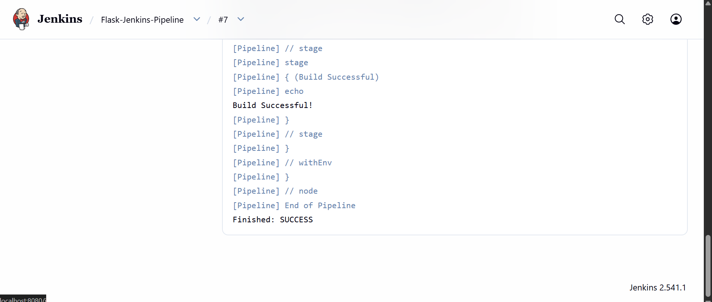
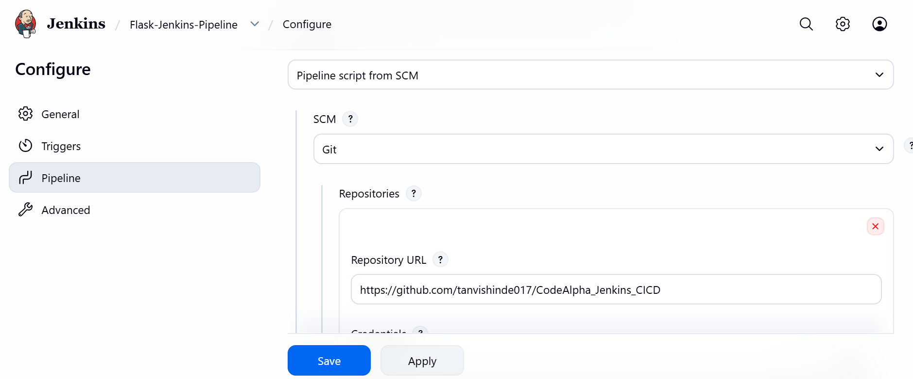

📌 CodeAlpha – Task 2
🚀 CI Pipeline using Jenkins (Flask Application)
📖 Project Overview

This project demonstrates the implementation of a Continuous Integration (CI) pipeline using Jenkins.

The pipeline automatically pulls code from GitHub and executes build stages defined in a Jenkinsfile.

This task was completed as part of the CodeAlpha DevOps Internship – Task 2.

🎯 Objective

To automate the build process using Jenkins and integrate it with a GitHub repository.

🛠 Technologies Used

Python

Flask

Git & GitHub

Jenkins

Windows Environment

🔁 CI Workflow

1️⃣ Code pushed to GitHub
2️⃣ Jenkins fetches repository
3️⃣ Jenkins reads the Jenkinsfile
4️⃣ Dependencies installed automatically
5️⃣ Pipeline executes stages
6️⃣ Build marked as SUCCESS

## 🖥 Jenkins Dashboard – Successful Build

## 📄 Console Output – Successful Execution

## ⚙️ Pipeline Configuration

🏗 Project Structure

CodeAlpha_Jenkins_CICD/
│
├── app.py
├── requirements.txt
├── Jenkinsfile
├── screenshots/
│   ├── jenkins-dashboard.png
│   ├── console-output.png
│   └── pipeline-config.png
└── README.md

✅ Proof of Successful CI

✔ Jenkins connected to GitHub
✔ Repository cloned successfully
✔ All pipeline stages executed
✔ Build status marked SUCCESS
✔ Console Output shows: Finished: SUCCESS

📌 What This Task Demonstrates

Understanding of CI concepts

GitHub–Jenkins integration

Automated build execution

Debugging pipeline errors

Real-world DevOps workflow

📈 Internship Progress

✅ Task 1 – Azure CI/CD Completed
✅ Task 2 – Jenkins CI Completed
⏳ Task 3 – In Progress

🙏 Acknowledgment

This project was completed as part of the CodeAlpha DevOps Internship, gaining hands-on experience with Jenkins automation and CI pipelines.

